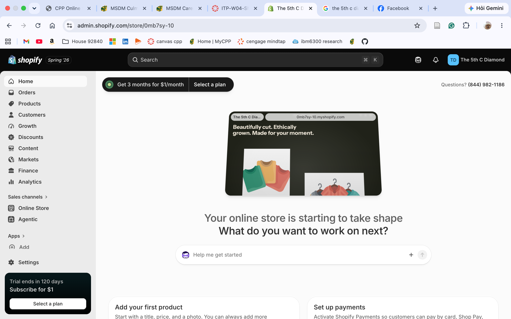
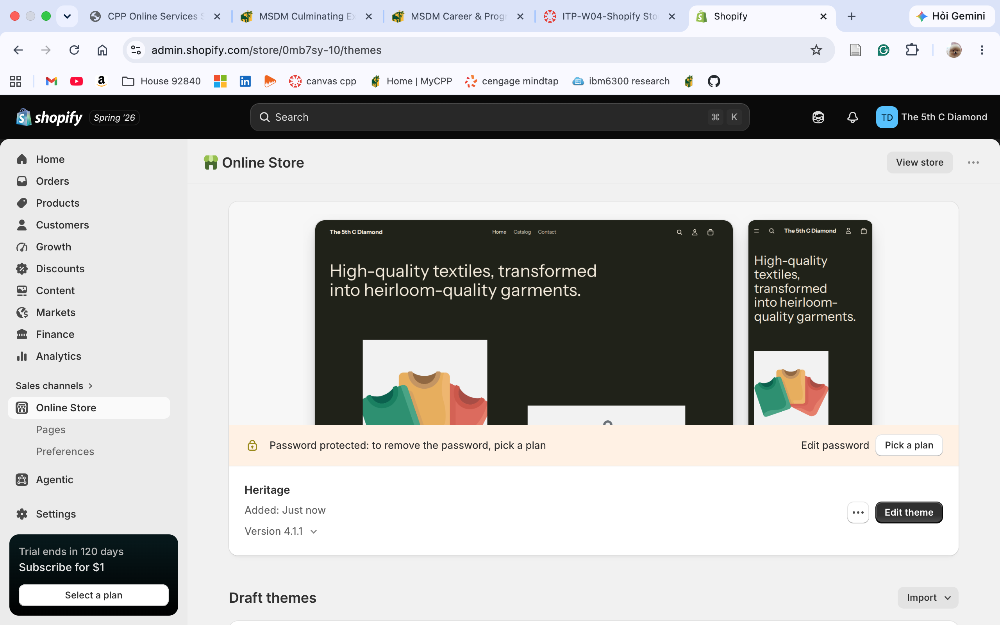
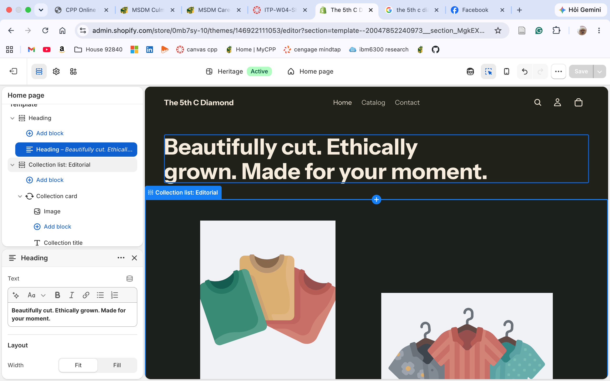

## Store Name and Concept

Store name: The 5th C Diamond

The 5th C Diamond is a direct-to-consumer fine jewelry store specializing in lab-grown diamond engagement rings, wedding bands, and everyday fine jewelry. The name plays on the traditional 4 Cs of diamond grading (cut, color, clarity, carat) and adds a fifth: conscience, since every diamond sold is lab-grown rather than mined. This positions the brand as a more affordable and more ethical alternative to traditional fine jewelry retailers. The store focuses on classic, elegant designs, particularly halo-style engagement rings, sold at a meaningfully lower price point than mined-diamond competitors of comparable size and clarity.

This is a practice Shopify store built for course purposes. No real payments are processed and no real transactions are conducted on this site.

## Target Customer

The primary target customer is a newly engaged or soon-to-be-engaged couple in their late 20s to mid 30s, shopping for an engagement ring or wedding band on a budget that prioritizes value and design over brand prestige.

Demographics: ages 26 to 38, household income in the middle to upper-middle range, often a dual-income couple making a joint purchase decision rather than a single shopper.

Lifestyle: comfortable researching extensively online before buying, values transparency in pricing, and is open to non-traditional retail paths such as online-first, direct-to-consumer brands rather than assuming a mall jewelry counter is the only legitimate option.

Shopping behavior: compares price per carat closely, reads reviews and certification details such as GIA or IGI grading reports before buying, and is motivated by both the emotional significance of the purchase and a practical desire to avoid feeling overcharged. Many in this segment have already researched lab-grown versus mined diamonds before arriving at the store.

A secondary, smaller customer segment includes shoppers buying fine jewelry as a gift for an anniversary, birthday, or other milestone occasion, who share similar price sensitivity but a shorter research and purchase cycle.

## Product Category Plan

The store will launch with the following five product categories.

1.  Engagement Rings. The core product line, with an emphasis on halo settings, solitaires, and vintage-inspired designs in lab-grown diamonds.
2.  Wedding Bands. Plain and diamond-accented bands for both partners, sized to complement the engagement ring line.
3.  Earrings. Diamond studs and small hoops, positioned as an accessible entry point for customers not yet ready for an engagement ring purchase.
4.  Necklaces and Pendants. Diamond pendant necklaces in a range of price points, useful for gifting occasions.
5.  Loose Lab-Grown Diamonds. Certified loose stones for customers who want to design a custom setting or have an existing setting reset, which also reinforces the brand's transparency and education first positioning.

## Initial Shopify Setup Evidence

### Shopify Admin Area

Screenshot of the main Shopify admin dashboard for The 5th C Diamond.

### Selected Theme

Screenshot of the Shopify theme library page showing the theme selected for this store. This theme was chosen for its clean, minimal layout, which suits fine jewelry product photography by letting the product images carry the visual weight rather than competing with busy page design.

### Homepage Draft and Theme Customization

Screenshot of the theme customizer showing the homepage draft in progress, including the store name, hero banner, and sections added so far.

## Connection to CPP Farm Store

Building out The 5th C Diamond's initial Shopify setup highlights several decisions that translate directly to the CPP Farm Store consulting project. Choosing a target customer first, before touching product categories or theme settings, made it clearer what the homepage and navigation should prioritize. For The 5th C Diamond, that meant leading with engagement rings and price transparency, while CPP Farm Store would need to lead with whatever its own core customer cares most about, whether that is freshness, local sourcing, or convenience. Picking a small, focused set of product categories rather than trying to sell everything at once is also a lesson that applies directly to CPP Farm Store, since a farm store's online presence likely benefits from the same kind of focused category structure rather than an overwhelming general catalog. Finally, working through Shopify's theme and homepage customization tools firsthand makes it easier to give CPP Farm Store realistic, specific recommendations about its own site, rather than only general advice about improving the online store.

## Appendix

GitHub Repository: <https://github.com/PhuLoi66/5th-c-diamond-shopify>

GitHub Pages (Published Report): <https://phuloi66.github.io/5th-c-diamond-shopify/>
